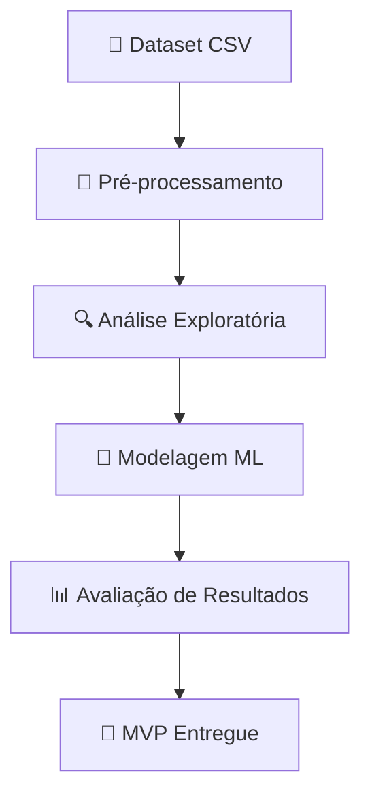

# 📊 MVP de Machine Learning – Consignados na Folha de Pagamento

## 🧩 Sobre o Projeto

Este repositório contém um **MVP (Minimum Viable Product)** de **Machine Learning** desenvolvido em Python e Jupyter Notebook.
O objetivo é **analisar e prever o comportamento da população em relação à contratação de consignados na folha de pagamento** do Município Alpha, a partir de variáveis como:

* 👤 **Idade**
* 🚻 **Sexo**
* 📈 **Quantidade de servidores**
* 💳 **Quantidade de empréstimos contratados**
* ⏳ **Tempo de serviço (com valores nulos para pensionistas)**

---

## ⚙️ Fluxo do Projeto



---

## 🔍 Principais Etapas

### 1️⃣ Análise Exploratória de Dados (EDA)

* Visualização da distribuição das variáveis.
* Tratamento de **valores nulos** em `TEMPO_SERVICO`.


---

### 2️⃣ Pré-processamento

* Normalização e padronização de variáveis.
* Criação de variáveis dummy para atributos categóricos.

---

### 3️⃣ Modelagem

Foi utilizado o seguinte algoritmo para problemas de Clusterização (não supervisionado):

* 🤖 **KMeans**


---

### 4️⃣ Avaliação

* 📊 **Métricas utilizadas**: *Elbow Method* e *Silhouette Score*.


---

## 📂 Estrutura do Repositório

```bash
📦 mvp-ml-consignados
 ┣ 📜 README.md
 ┣ 📓 mvp-clusterization.ipynb   # Notebook principal
 ┣ 📂 data
 ┃ ┗ 📜 consig_dataset.min.csv   # Dataset utilizado
 ┗ 📂 results
    ┗ 📊 gráficos_e_metricas.png # Resultados do MVP
```

---

## 🚀 Tecnologias Utilizadas

* 🐍 **Python 3.11**
* 📘 **Jupyter Notebook**
* 📊 **Pandas, Numpy, Matplotlib, Seaborn**
* 🤖 **Scikit-learn**

---

## ✨ Próximos Passos

* 🔎 Desenvolvimento de algoritmos para tratar cada cluster separadamente

---

## 👨‍💻 Autor

Feito com dedicação por **Daniel Chipolesch** 💡
📌 [LinkedIn](https://br.linkedin.com/in/daniel-chipolesch-116719124) | 📌 [GitHub](https://github.com/danielchipolesch)

---